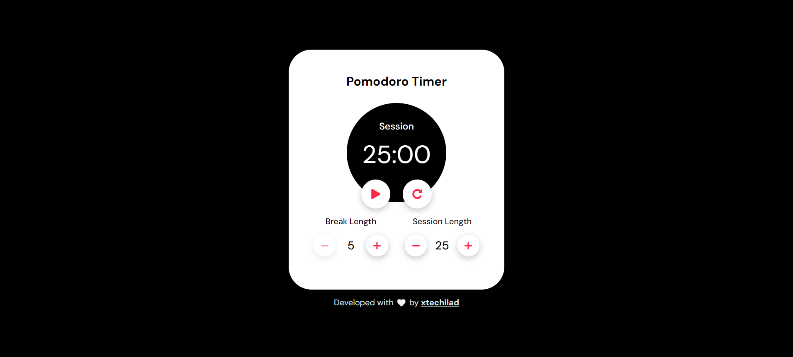

# Clock Application

This is a clock application built with HTML, CSS, and JavaScript. The application helps users manage their time using the Pomodoro Technique, a time management method developed by Francesco Cirillo. The technique uses a timer to break work into intervals, traditionally 25 minutes in length, separated by short breaks.



## Features

- Set customizable work and break durations.
- Start, pause, and reset the timer.
- Visual indicators for the current session (work or break).
- Sound notifications when a session ends or a break ends.

## Getting Started

To use the application locally, follow these steps:

1. Clone the repository:

```bash
   git clone 
```

2. Navigate to the project directory:

```bash
    cd clock
```

3. Open the index.html file in your preferred web browser.

## Usage

1. Set the desired work duration in minutes using the increment/decrement buttons. The default duration is 25 minutes.
2. Set the desired break duration in minutes using the increment/decrement buttons. The default duration is 5 minutes.
3. Click the "Start" button to begin the timer.
4. Work sessions will be indicated with a timer and a label indicating "Session".
5. Break sessions will be indicated with a timer and a label indicating "Break".
6. When a session or a break ends, a sound notification will play.
7. To pause the timer, click the "Pause" button. To resume, click "Start" again.
8. To reset the timer and start a new session, click the "Reset" button.

## Acknowledgements

Special thanks to [OpenAI](https://openai.com/) for providing the underlying language model used to generate this README.
